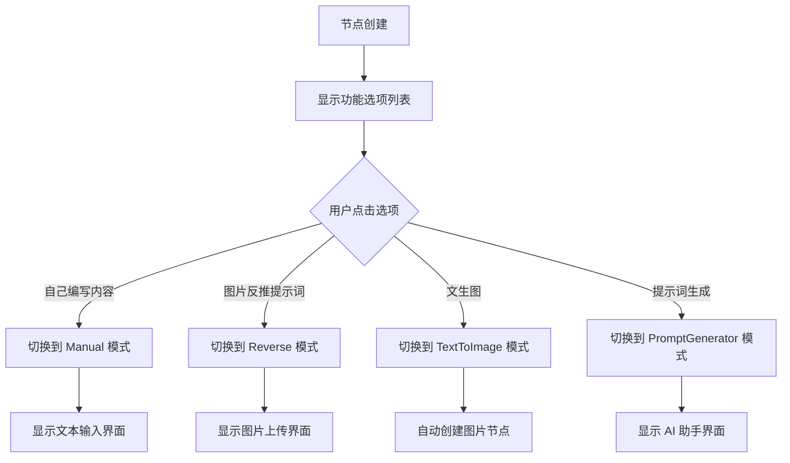
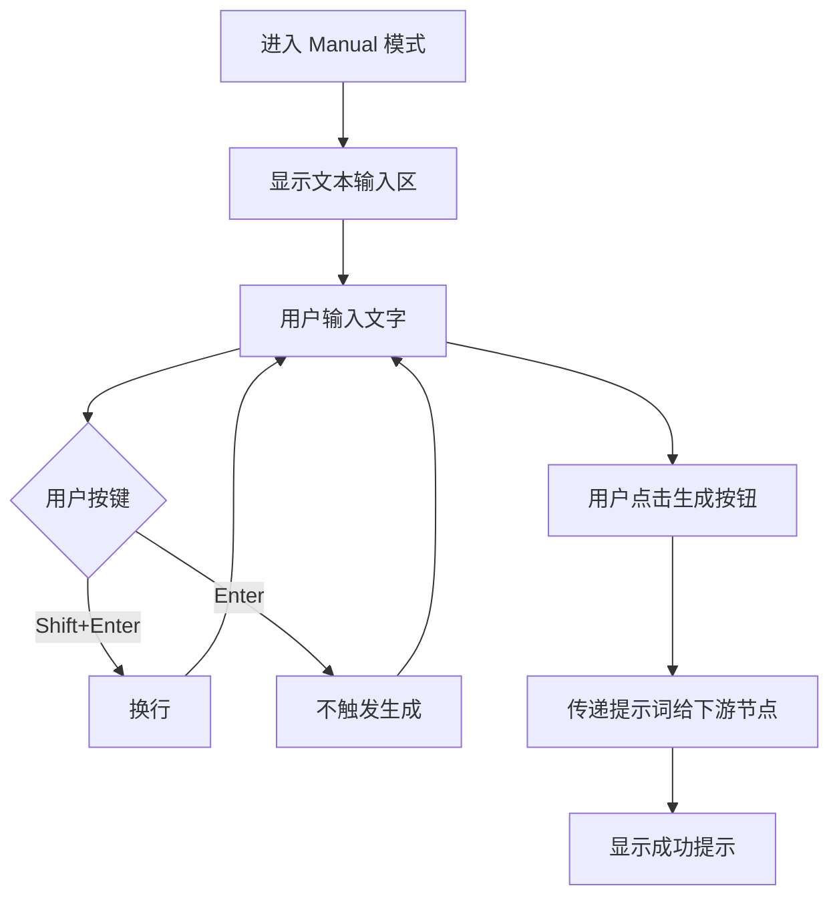
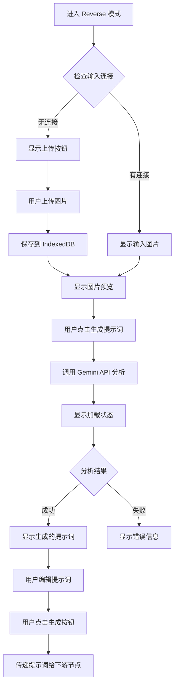
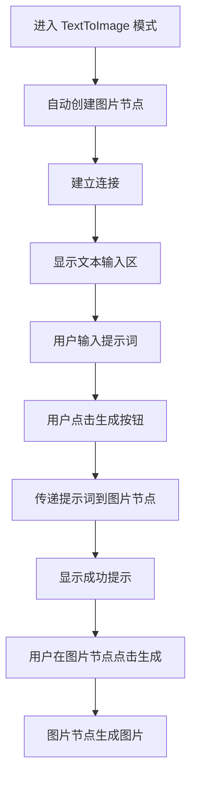
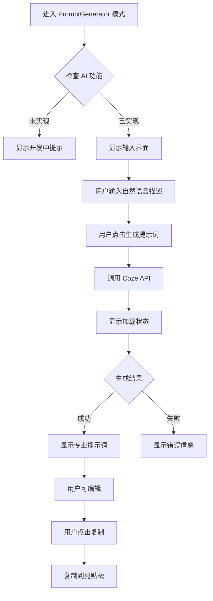

# 文字节点升级 - 设计文档

**日期**: 2026-02-03  
**状态**: 📝 设计中  
**优先级**: 🔥 高

---

## 📋 目录

1. [设计概述](#设计概述)
2. [数据结构设计](#数据结构设计)
3. [组件架构设计](#组件架构设计)
4. [状态管理设计](#状态管理设计)
5. [UI 组件设计](#ui-组件设计)
6. [交互流程设计](#交互流程设计)
7. [API 集成设计](#api-集成设计)
8. [性能优化设计](#性能优化设计)
9. [错误处理设计](#错误处理设计)
10. [测试策略](#测试策略)

---

## 🎯 设计概述

### 核心目标

将文字节点从单一的文本输入节点升级为**多功能智能节点**，支持 4 个模式：
1. ✏️ **自己编写内容** - 手动输入文字
2. 🔍 **图片反推提示词** - 从图片分析生成提示词
3. 🖼️ **文生图** - 文字生成图片
4. ✨ **提示词生成** - 用自然语言生成专业提示词

### 设计原则

1. **遵守三层架构** - UI Layer → Hooks Layer → Core Layer
2. **单一职责** - 每个组件只负责一件事
3. **可扩展性** - 易于添加新模式
4. **性能优先** - React.memo + useCallback
5. **用户体验** - 流畅的交互和清晰的反馈

---

## 📊 数据结构设计

### 1. 节点数据接口

```typescript
/**
 * 文字节点模式枚举
 */
export enum TextNodeMode {
  INITIAL = 'initial',              // 初始状态（显示功能选项列表）
  MANUAL = 'manual',                // 自己编写内容
  REVERSE = 'reverse',              // 图片反推提示词
  TEXT_TO_IMAGE = 'text-to-image',  // 文生图
  PROMPT_GENERATOR = 'prompt-generator', // 提示词生成
}

/**
 * 文字节点数据接口
 */
export interface TextNodeData {
  // ========== 通用字段 ==========
  /** 当前模式 */
  mode?: TextNodeMode;
  
  /** 用户输入的文字/提示词 */
  prompt?: string;
  
  /** 选择的 AI 模型 */
  model?: string;
  
  /** 错误信息 */
  error?: string;
  
  // ========== 图片反推模式 ==========
  /** 输入图片（Base64 或 Blob URL） */
  inputImage?: string;
  
  /** AI 生成的提示词 */
  generatedPrompt?: string;
  
  /** 用户编辑后的提示词 */
  editedPrompt?: string;
  
  /** 是否正在分析 */
  isAnalyzing?: boolean;
  
  // ========== 文生图模式 ==========
  /** 自动生成的输出节点 ID */
  outputNodeId?: string;
  
  // ========== 提示词生成模式 ==========
  /** 用户的自然语言描述 */
  userInput?: string;
  
  /** 是否正在生成 */
  isGenerating?: boolean;
}
```


### 2. 节点注册定义

```typescript
// 在 core/registry/NodeRegistry.ts 中注册
{
  type: NodeType.PROMPT_INPUT,
  name: '文字',
  iconName: 'Type',
  defaultWidth: 420,
  defaultHeight: 280,  // 初始状态高度
  defaultData: {
    mode: TextNodeMode.INITIAL,  // 默认显示功能选项列表
    prompt: '',
    model: 'gemini-3-pro',  // 默认模型
  },
  category: 'basic',
  description: '多功能文字节点：手动输入、提示词反推、文生图、提示词生成',
}
```

### 3. 状态管理接口

```typescript
/**
 * 文字节点 Store 接口
 */
export interface TextNodeStore {
  /** 更新节点模式 */
  updateMode: (nodeId: string, mode: TextNodeMode) => void;
  
  /** 更新提示词 */
  updatePrompt: (nodeId: string, prompt: string) => void;
  
  /** 更新输入图片 */
  updateInputImage: (nodeId: string, image: string) => void;
  
  /** 开始分析 */
  startAnalyzing: (nodeId: string) => void;
  
  /** 完成分析 */
  finishAnalyzing: (nodeId: string, prompt: string) => void;
  
  /** 分析失败 */
  failAnalyzing: (nodeId: string, error: string) => void;
  
  /** 创建输出节点（文生图模式） */
  createOutputNode: (nodeId: string, position: { x: number; y: number }) => string;
  
  /** 重置节点（返回初始状态） */
  resetNode: (nodeId: string) => void;
}
```

---

## 🏗️ 组件架构设计

### 1. 组件层次结构

```
TextNode (主组件)
├── TextNodeInitial (初始状态 - 功能选项列表)
├── TextNodeManual (模式 1 - 自己编写内容)
├── TextNodeReverse (模式 2 - 图片反推提示词)
│   ├── ImageUploader (图片上传组件)
│   ├── ImagePreview (图片预览组件)
│   └── PromptEditor (提示词编辑组件)
├── TextNodeTextToImage (模式 3 - 文生图)
└── TextNodePromptGenerator (模式 4 - 提示词生成)
    ├── UserInputArea (用户输入区域)
    └── GeneratedPromptDisplay (生成结果显示)
```

### 2. 组件职责划分

#### TextNode (主组件)
- **职责**: 根据 mode 渲染对应的子组件
- **位置**: `components/TextNode.tsx`
- **依赖**: 所有子组件

#### TextNodeInitial (初始状态)
- **职责**: 显示 4 个功能选项列表
- **位置**: `components/TextNode/TextNodeInitial.tsx`
- **交互**: 点击选项切换模式

#### TextNodeManual (自己编写内容)
- **职责**: 提供文本输入区域和生成按钮
- **位置**: `components/TextNode/TextNodeManual.tsx`
- **交互**: 输入文字 → 点击生成 → 传递给下游

#### TextNodeReverse (图片反推提示词)
- **职责**: 图片上传/显示 + AI 分析 + 提示词编辑
- **位置**: `components/TextNode/TextNodeReverse.tsx`
- **交互**: 上传图片 → 点击分析 → 编辑提示词 → 点击生成

#### TextNodeTextToImage (文生图)
- **职责**: 文本输入 + 自动创建图片节点
- **位置**: `components/TextNode/TextNodeTextToImage.tsx`
- **交互**: 输入提示词 → 点击生成 → 传递给图片节点

#### TextNodePromptGenerator (提示词生成)
- **职责**: 自然语言输入 + AI 生成专业提示词
- **位置**: `components/TextNode/TextNodePromptGenerator.tsx`
- **交互**: 输入描述 → 点击生成 → 显示结果 → 复制

### 3. 共享组件

#### APIToolbar (API 工具栏)
- **职责**: 显示 API 模型选择下拉框
- **位置**: `components/TextNode/APIToolbar.tsx`
- **显示逻辑**: 节点选中时显示，不选中时隐藏
- **位置**: 节点下方外部浮动

#### GenerateButton (生成按钮)
- **职责**: 统一的生成按钮样式
- **位置**: `components/TextNode/GenerateButton.tsx`
- **变体**: 主要按钮、次要按钮、加载状态

#### BackButton (返回按钮)
- **职责**: 返回初始状态
- **位置**: 节点内部左上角
- **交互**: 点击 → 清除数据 → 返回初始状态

---

## 🔄 状态管理设计

### 1. Store 设计

使用 Zustand + Immer 管理节点状态：

```typescript
// core/stores/textNodeStore.ts
import { create } from 'zustand';
import { immer } from 'zustand/middleware/immer';
import { TextNodeMode, TextNodeData } from '../../types';

interface TextNodeState {
  // 节点数据映射
  nodes: Map<string, TextNodeData>;
  
  // 操作方法
  updateMode: (nodeId: string, mode: TextNodeMode) => void;
  updatePrompt: (nodeId: string, prompt: string) => void;
  updateInputImage: (nodeId: string, image: string) => void;
  startAnalyzing: (nodeId: string) => void;
  finishAnalyzing: (nodeId: string, prompt: string) => void;
  failAnalyzing: (nodeId: string, error: string) => void;
  createOutputNode: (nodeId: string, position: { x: number; y: number }) => string;
  resetNode: (nodeId: string) => void;
}

export const useTextNodeStore = create<TextNodeState>()(
  immer((set, get) => ({
    nodes: new Map(),
    
    updateMode: (nodeId, mode) => set((state) => {
      const node = state.nodes.get(nodeId);
      if (node) {
        node.mode = mode;
      }
    }),
    
    updatePrompt: (nodeId, prompt) => set((state) => {
      const node = state.nodes.get(nodeId);
      if (node) {
        node.prompt = prompt;
      }
    }),
    
    // ... 其他方法
  }))
);
```


### 2. Hook 设计

#### useTextNodeActions (文字节点操作 Hook)

```typescript
// hooks/useTextNodeActions.ts
import { useCallback } from 'react';
import { useTextNodeStore } from '../core/stores/textNodeStore';
import { useNodeStore } from '../core/stores/nodeStore';
import { TextNodeMode } from '../types';

export function useTextNodeActions(nodeId: string) {
  const textNodeStore = useTextNodeStore();
  const nodeStore = useNodeStore();
  
  // 切换模式
  const switchMode = useCallback((mode: TextNodeMode) => {
    textNodeStore.updateMode(nodeId, mode);
  }, [nodeId, textNodeStore]);
  
  // 更新提示词
  const updatePrompt = useCallback((prompt: string) => {
    textNodeStore.updatePrompt(nodeId, prompt);
  }, [nodeId, textNodeStore]);
  
  // 上传图片
  const uploadImage = useCallback(async (file: File) => {
    // 保存到 IndexedDB
    const { saveFileToIndexedDBAsync } = await import('../services/blobStorage');
    const blobUrl = await saveFileToIndexedDBAsync(nodeId, file);
    
    // 更新节点数据
    textNodeStore.updateInputImage(nodeId, blobUrl);
  }, [nodeId, textNodeStore]);
  
  // 分析图片
  const analyzeImage = useCallback(async (image: string) => {
    textNodeStore.startAnalyzing(nodeId);
    
    try {
      // 调用 Gemini API 分析图片
      const { analyzeImageForPrompt } = await import('../services/geminiService');
      const prompt = await analyzeImageForPrompt(image);
      
      textNodeStore.finishAnalyzing(nodeId, prompt);
    } catch (error) {
      textNodeStore.failAnalyzing(nodeId, error.message);
    }
  }, [nodeId, textNodeStore]);
  
  // 生成提示词（AI 助手模式）
  const generatePrompt = useCallback(async (userInput: string) => {
    textNodeStore.startGenerating(nodeId);
    
    try {
      // 调用 Coze API 生成提示词
      const { generatePromptFromDescription } = await import('../services/cozeService');
      const prompt = await generatePromptFromDescription(userInput);
      
      textNodeStore.finishGenerating(nodeId, prompt);
    } catch (error) {
      textNodeStore.failGenerating(nodeId, error.message);
    }
  }, [nodeId, textNodeStore]);
  
  // 创建输出节点（文生图模式）
  const createOutputNode = useCallback(() => {
    const node = nodeStore.getNode(nodeId);
    if (!node) return;
    
    const position = {
      x: node.x + 500,  // 在右侧
      y: node.y,
    };
    
    const outputNodeId = textNodeStore.createOutputNode(nodeId, position);
    return outputNodeId;
  }, [nodeId, textNodeStore, nodeStore]);
  
  // 传递提示词给下游节点
  const passPromptToDownstream = useCallback((prompt: string) => {
    const node = nodeStore.getNode(nodeId);
    if (!node) return;
    
    // 获取所有下游节点
    const connections = nodeStore.getConnectionsFrom(nodeId);
    
    connections.forEach(conn => {
      const targetNode = nodeStore.getNode(conn.to);
      if (targetNode) {
        // 更新下游节点的 prompt 字段
        nodeStore.updateNode(conn.to, { prompt });
      }
    });
  }, [nodeId, nodeStore]);
  
  // 重置节点
  const resetNode = useCallback(() => {
    textNodeStore.resetNode(nodeId);
  }, [nodeId, textNodeStore]);
  
  return {
    switchMode,
    updatePrompt,
    uploadImage,
    analyzeImage,
    generatePrompt,
    createOutputNode,
    passPromptToDownstream,
    resetNode,
  };
}
```

---

## 🎨 UI 组件设计

### 1. TextNodeInitial (初始状态)

**布局**: 垂直列表，4 个功能选项

```typescript
// components/TextNode/TextNodeInitial.tsx
import React from 'react';
import { TextNodeMode } from '../../types';

interface TextNodeInitialProps {
  onSelectMode: (mode: TextNodeMode) => void;
}

export const TextNodeInitial: React.FC<TextNodeInitialProps> = React.memo(({ onSelectMode }) => {
  const options = [
    { mode: TextNodeMode.MANUAL, label: '自己编写内容' },
    { mode: TextNodeMode.REVERSE, label: '图片反推提示词' },
    { mode: TextNodeMode.TEXT_TO_IMAGE, label: '文生图' },
    { mode: TextNodeMode.PROMPT_GENERATOR, label: '提示词生成' },
  ];
  
  return (
    <div className="flex flex-col gap-2 p-4">
      {/* 分类标签 */}
      <div className="text-[10px] font-bold text-gray-400/60 mb-1">
        尝试:
      </div>
      
      {/* 选项列表 */}
      <div className="flex flex-col gap-1">
        {options.map(option => (
          <button
            key={option.mode}
            onClick={() => onSelectMode(option.mode)}
            className="w-full px-3 py-2 rounded-lg bg-transparent 
                       hover:bg-white/5 border border-transparent 
                       hover:border-white/10 
                       flex items-center gap-2.5 
                       cursor-pointer transition-all text-left"
          >
            <span className="text-[11px] font-medium text-gray-300">
              {option.label}
            </span>
          </button>
        ))}
      </div>
    </div>
  );
});
```

### 2. TextNodeManual (自己编写内容)

**布局**: 大面积文本输入区 + 右下角生成按钮

```typescript
// components/TextNode/TextNodeManual.tsx
import React, { useState, useCallback } from 'react';

interface TextNodeManualProps {
  initialPrompt?: string;
  onGenerate: (prompt: string) => void;
  onBack: () => void;
}

export const TextNodeManual: React.FC<TextNodeManualProps> = React.memo(({
  initialPrompt = '',
  onGenerate,
  onBack,
}) => {
  const [localPrompt, setLocalPrompt] = useState(initialPrompt);
  
  const handleGenerate = useCallback(() => {
    if (!localPrompt.trim()) {
      // 显示提示
      return;
    }
    onGenerate(localPrompt);
  }, [localPrompt, onGenerate]);
  
  const handleKeyDown = useCallback((e: React.KeyboardEvent) => {
    // Shift+Enter 换行，不触发生成
    if (e.key === 'Enter' && !e.shiftKey) {
      e.preventDefault();
      // 不触发生成，只有点击按钮才生成
    }
  }, []);
  
  return (
    <div className="relative w-full h-full flex flex-col">
      {/* 返回按钮 */}
      <button
        onClick={onBack}
        className="absolute top-2 left-2 p-1.5 rounded-lg 
                   bg-white/5 hover:bg-white/10 
                   border border-white/10 
                   transition-colors z-10"
      >
        <ArrowLeft size={14} className="text-gray-400" />
      </button>
      
      {/* 文本输入区域 */}
      <textarea
        className="w-full h-full bg-transparent resize-none 
                   focus:outline-none text-sm text-slate-200 
                   placeholder-slate-500 font-medium leading-relaxed 
                   custom-scrollbar selection:bg-amber-500/30
                   px-4 py-3 pt-12"
        placeholder="描述你想要生成的内容（Shift+Enter 换行）"
        value={localPrompt}
        onChange={(e) => setLocalPrompt(e.target.value)}
        onKeyDown={handleKeyDown}
        maxLength={1000}
      />
      
      {/* 字数统计 */}
      <div className="absolute bottom-16 right-4 text-[9px] text-gray-500">
        {localPrompt.length}/1000
      </div>
      
      {/* 生成按钮 */}
      <button
        onClick={handleGenerate}
        disabled={!localPrompt.trim()}
        className="absolute bottom-4 right-4 
                   px-4 py-2 text-[11px] font-bold text-white 
                   bg-blue-500 hover:bg-blue-600 rounded-lg 
                   transition-colors disabled:opacity-50 disabled:cursor-not-allowed"
      >
        生成
      </button>
    </div>
  );
});
```


### 3. TextNodeReverse (图片反推提示词)

**布局**: 图片预览区 + 分析按钮 + 提示词编辑区 + 生成按钮

```typescript
// components/TextNode/TextNodeReverse.tsx
import React, { useState, useCallback } from 'react';
import { Upload, Loader2 } from 'lucide-react';

interface TextNodeReverseProps {
  inputImage?: string;
  generatedPrompt?: string;
  isAnalyzing?: boolean;
  hasInputConnection: boolean;
  onUploadImage: (file: File) => void;
  onAnalyze: () => void;
  onUpdatePrompt: (prompt: string) => void;
  onGenerate: (prompt: string) => void;
  onBack: () => void;
}

export const TextNodeReverse: React.FC<TextNodeReverseProps> = React.memo(({
  inputImage,
  generatedPrompt = '',
  isAnalyzing = false,
  hasInputConnection,
  onUploadImage,
  onAnalyze,
  onUpdatePrompt,
  onGenerate,
  onBack,
}) => {
  const [editedPrompt, setEditedPrompt] = useState(generatedPrompt);
  
  const handleFileChange = useCallback((e: React.ChangeEvent<HTMLInputElement>) => {
    const file = e.target.files?.[0];
    if (file) {
      onUploadImage(file);
    }
  }, [onUploadImage]);
  
  const handleGenerate = useCallback(() => {
    if (!editedPrompt.trim()) return;
    onGenerate(editedPrompt);
  }, [editedPrompt, onGenerate]);
  
  return (
    <div className="relative w-full h-full flex flex-col p-4 gap-3">
      {/* 返回按钮 */}
      <button
        onClick={onBack}
        className="absolute top-2 left-2 p-1.5 rounded-lg 
                   bg-white/5 hover:bg-white/10 
                   border border-white/10 
                   transition-colors z-10"
      >
        <ArrowLeft size={14} className="text-gray-400" />
      </button>
      
      {/* 图片预览区 */}
      <div className="w-full h-32 rounded-xl bg-black/20 border border-white/5 
                      overflow-hidden flex items-center justify-center">
        {inputImage ? (
          
        ) : hasInputConnection ? (
          <div className="text-slate-500 text-[10px]">
            等待图片输入...
          </div>
        ) : (
          <label className="cursor-pointer flex flex-col items-center gap-2">
            <Upload size={24} className="text-gray-500" />
            <span className="text-[10px] text-gray-500">点击上传图片</span>
            <input
              type="file"
              accept="image/*"
              onChange={handleFileChange}
              className="hidden"
            />
          </label>
        )}
      </div>
      
      {/* 分析按钮 */}
      <button
        onClick={onAnalyze}
        disabled={!inputImage || isAnalyzing}
        className="w-full px-3 py-2 text-[11px] font-bold text-white 
                   bg-purple-500 hover:bg-purple-600 rounded-lg 
                   transition-colors disabled:opacity-50 disabled:cursor-not-allowed
                   flex items-center justify-center gap-2"
      >
        {isAnalyzing ? (
          <>
            <Loader2 size={14} className="animate-spin" />
            <span>分析中...</span>
          </>
        ) : (
          '生成提示词'
        )}
      </button>
      
      {/* 提示词编辑区 */}
      <div className="flex-1 flex flex-col gap-1">
        <div className="text-[9px] text-gray-400">
          {generatedPrompt ? 'AI 生成的提示词（可编辑）:' : '提示词将显示在这里...'}
        </div>
        <textarea
          className="flex-1 w-full bg-white/5 border border-white/10 
                     rounded-lg text-[11px] text-gray-200 
                     placeholder-gray-500 focus:outline-none focus:border-blue-500
                     px-3 py-2 resize-none custom-scrollbar"
          placeholder="AI 生成的提示词将显示在这里，您可以编辑..."
          value={editedPrompt}
          onChange={(e) => {
            setEditedPrompt(e.target.value);
            onUpdatePrompt(e.target.value);
          }}
          disabled={!generatedPrompt}
        />
      </div>
      
      {/* 生成按钮 */}
      <button
        onClick={handleGenerate}
        disabled={!editedPrompt.trim()}
        className="w-full px-4 py-2 text-[11px] font-bold text-white 
                   bg-blue-500 hover:bg-blue-600 rounded-lg 
                   transition-colors disabled:opacity-50 disabled:cursor-not-allowed"
      >
        生成
      </button>
    </div>
  );
});
```

### 4. TextNodeTextToImage (文生图)

**布局**: 文本输入区 + 连接状态指示 + 生成按钮

```typescript
// components/TextNode/TextNodeTextToImage.tsx
import React, { useState, useCallback, useEffect } from 'react';
import { Link2 } from 'lucide-react';

interface TextNodeTextToImageProps {
  initialPrompt?: string;
  outputNodeId?: string;
  onCreateOutputNode: () => string;
  onGenerate: (prompt: string) => void;
  onBack: () => void;
}

export const TextNodeTextToImage: React.FC<TextNodeTextToImageProps> = React.memo(({
  initialPrompt = '',
  outputNodeId,
  onCreateOutputNode,
  onGenerate,
  onBack,
}) => {
  const [localPrompt, setLocalPrompt] = useState(initialPrompt);
  const [isConnected, setIsConnected] = useState(!!outputNodeId);
  
  // 自动创建输出节点
  useEffect(() => {
    if (!outputNodeId) {
      const newNodeId = onCreateOutputNode();
      setIsConnected(!!newNodeId);
    }
  }, [outputNodeId, onCreateOutputNode]);
  
  const handleGenerate = useCallback(() => {
    if (!localPrompt.trim()) return;
    onGenerate(localPrompt);
  }, [localPrompt, onGenerate]);
  
  return (
    <div className="relative w-full h-full flex flex-col">
      {/* 返回按钮 */}
      <button
        onClick={onBack}
        className="absolute top-2 left-2 p-1.5 rounded-lg 
                   bg-white/5 hover:bg-white/10 
                   border border-white/10 
                   transition-colors z-10"
      >
        <ArrowLeft size={14} className="text-gray-400" />
      </button>
      
      {/* 文本输入区域 */}
      <textarea
        className="w-full h-full bg-transparent resize-none 
                   focus:outline-none text-sm text-slate-200 
                   placeholder-slate-500 font-medium leading-relaxed 
                   custom-scrollbar selection:bg-amber-500/30
                   px-4 py-3 pt-12 pb-20"
        placeholder="输入图片生成提示词..."
        value={localPrompt}
        onChange={(e) => setLocalPrompt(e.target.value)}
        maxLength={1000}
      />
      
      {/* 连接状态指示 */}
      {isConnected && (
        <div className="absolute bottom-16 left-4 flex items-center gap-2 text-[9px] text-gray-500">
          <div className="w-2 h-2 rounded-full bg-green-500 animate-pulse"></div>
          <Link2 size={10} />
          <span>已连接到图片节点</span>
        </div>
      )}
      
      {/* 字数统计 */}
      <div className="absolute bottom-16 right-4 text-[9px] text-gray-500">
        {localPrompt.length}/1000
      </div>
      
      {/* 生成按钮 */}
      <button
        onClick={handleGenerate}
        disabled={!localPrompt.trim() || !isConnected}
        className="absolute bottom-4 right-4 
                   px-4 py-2 text-[11px] font-bold text-white 
                   bg-blue-500 hover:bg-blue-600 rounded-lg 
                   transition-colors disabled:opacity-50 disabled:cursor-not-allowed"
      >
        生成
      </button>
    </div>
  );
});
```


### 5. TextNodePromptGenerator (提示词生成)

**布局**: 用户输入区 + 生成按钮 + 结果显示区 + 复制按钮

```typescript
// components/TextNode/TextNodePromptGenerator.tsx
import React, { useState, useCallback } from 'react';
import { Loader2, Copy, Check } from 'lucide-react';

interface TextNodePromptGeneratorProps {
  userInput?: string;
  generatedPrompt?: string;
  isGenerating?: boolean;
  onGenerate: (userInput: string) => void;
  onBack: () => void;
}

export const TextNodePromptGenerator: React.FC<TextNodePromptGeneratorProps> = React.memo(({
  userInput = '',
  generatedPrompt = '',
  isGenerating = false,
  onGenerate,
  onBack,
}) => {
  const [localInput, setLocalInput] = useState(userInput);
  const [localPrompt, setLocalPrompt] = useState(generatedPrompt);
  const [copied, setCopied] = useState(false);
  
  const handleGenerate = useCallback(() => {
    if (!localInput.trim()) return;
    onGenerate(localInput);
  }, [localInput, onGenerate]);
  
  const handleCopy = useCallback(() => {
    navigator.clipboard.writeText(localPrompt);
    setCopied(true);
    setTimeout(() => setCopied(false), 2000);
  }, [localPrompt]);
  
  // 检查 AI 导演功能是否可用
  const isAIDirectorAvailable = false; // TODO: 检查 Coze API 是否配置
  
  return (
    <div className="relative w-full h-full flex flex-col p-4 gap-3">
      {/* 返回按钮 */}
      <button
        onClick={onBack}
        className="absolute top-2 left-2 p-1.5 rounded-lg 
                   bg-white/5 hover:bg-white/10 
                   border border-white/10 
                   transition-colors z-10"
      >
        <ArrowLeft size={14} className="text-gray-400" />
      </button>
      
      {isAIDirectorAvailable ? (
        <>
          {/* 用户输入区域 */}
          <div className="flex flex-col gap-1">
            <div className="text-[9px] text-gray-400">描述您的需求：</div>
            <textarea
              className="w-full h-24 bg-white/5 border border-white/10 
                         rounded-lg text-[11px] text-gray-200 
                         placeholder-gray-500 focus:outline-none focus:border-blue-500
                         px-3 py-2 resize-none custom-scrollbar"
              placeholder="例如：我想要一个赛博朋克风格的机器人，背景是霓虹灯城市..."
              value={localInput}
              onChange={(e) => setLocalInput(e.target.value)}
              maxLength={500}
            />
            <div className="text-[9px] text-gray-500 text-right">
              {localInput.length}/500
            </div>
          </div>
          
          {/* 生成提示词按钮 */}
          <button
            onClick={handleGenerate}
            disabled={!localInput.trim() || isGenerating}
            className="w-full px-4 py-2 bg-purple-500 hover:bg-purple-600 
                       rounded-lg text-[11px] font-bold text-white 
                       transition-colors disabled:opacity-50 disabled:cursor-not-allowed
                       flex items-center justify-center gap-2"
          >
            {isGenerating ? (
              <>
                <Loader2 size={14} className="animate-spin" />
                <span>生成中...</span>
              </>
            ) : (
              '生成提示词'
            )}
          </button>
          
          {/* 生成的提示词显示区域 */}
          {generatedPrompt && (
            <div className="flex-1 flex flex-col gap-1">
              <div className="flex items-center justify-between">
                <div className="text-[9px] text-gray-400">生成的专业提示词：</div>
                <button
                  onClick={handleCopy}
                  className="text-[9px] text-blue-400 hover:text-blue-300 
                             flex items-center gap-1 transition-colors"
                >
                  {copied ? (
                    <>
                      <Check size={10} />
                      <span>已复制</span>
                    </>
                  ) : (
                    <>
                      <Copy size={10} />
                      <span>复制</span>
                    </>
                  )}
                </button>
              </div>
              <textarea
                className="flex-1 w-full bg-white/5 border border-white/10 
                           rounded-lg text-[11px] text-gray-200 
                           px-3 py-2 resize-none custom-scrollbar"
                value={localPrompt}
                onChange={(e) => setLocalPrompt(e.target.value)}
              />
            </div>
          )}
          
          {/* 功能说明 */}
          <div className="text-[9px] text-gray-500 text-center">
            💡 AI 会将您的自然语言描述转换为专业的提示词
          </div>
        </>
      ) : (
        /* 功能开发中提示 */
        <div className="flex-1 flex flex-col items-center justify-center gap-4">
          <div className="text-[11px] text-gray-400 text-center">
            🚧 功能开发中
          </div>
          <div className="text-[9px] text-gray-500 text-center max-w-xs">
            提示词生成功能需要 AI 导演（Coze API）支持，
            该功能正在开发中，敬请期待。
          </div>
        </div>
      )}
    </div>
  );
});
```

### 6. APIToolbar (API 工具栏)

**位置**: 节点下方外部浮动

```typescript
// components/TextNode/APIToolbar.tsx
import React from 'react';

interface APIToolbarProps {
  selectedModel: string;
  onModelChange: (model: string) => void;
  isVisible: boolean;
}

export const APIToolbar: React.FC<APIToolbarProps> = React.memo(({
  selectedModel,
  onModelChange,
  isVisible,
}) => {
  if (!isVisible) return null;
  
  const models = [
    { value: 'gemini-3-pro', label: 'Gemini 3 Pro' },
    { value: 'gemini-2-flash', label: 'Gemini 2 Flash' },
    { value: 'claude-sonnet', label: 'Claude Sonnet' },
  ];
  
  return (
    <div className="absolute top-full left-0 mt-2 
                    flex items-center gap-2 
                    px-3 py-2 
                    bg-white/90 backdrop-blur-xl 
                    border border-gray-200/80 
                    rounded-lg shadow-lg z-50">
      <select
        value={selectedModel}
        onChange={(e) => onModelChange(e.target.value)}
        className="px-2.5 py-1.5 text-[10px] font-medium 
                   text-gray-600 bg-transparent 
                   border border-gray-200 rounded-md 
                   hover:bg-gray-50 transition-colors
                   cursor-pointer focus:outline-none focus:border-blue-500"
      >
        {models.map(model => (
          <option key={model.value} value={model.value}>
            {model.label}
          </option>
        ))}
      </select>
    </div>
  );
});
```

---

## 🔄 交互流程设计

### 1. 初始状态 → 选择模式



### 2. 模式 1：自己编写内容



### 3. 模式 2：图片反推提示词




### 4. 模式 3：文生图



### 5. 模式 4：提示词生成



---

## 🔌 API 集成设计

### 1. Gemini API 集成（图片反推提示词）

```typescript
// services/geminiService.ts

/**
 * 分析图片生成提示词
 * @param imageData Base64 或 Blob URL
 * @returns 生成的提示词
 */
export async function analyzeImageForPrompt(imageData: string): Promise<string> {
  try {
    // 1. 转换图片格式（如果需要）
    const base64Image = await convertToBase64(imageData);
    
    // 2. 构建 Gemini API 请求
    const prompt = `
      请分析这张图片，生成一个详细的图片生成提示词。
      
      要求：
      1. 描述画面的主要内容和构图
      2. 描述色调、光线、氛围
      3. 描述艺术风格（如果有）
      4. 使用专业的图片生成术语
      5. 提示词长度控制在 200 字以内
      
      只返回提示词本身，不要其他说明。
    `;
    
    // 3. 调用 Gemini API
    const response = await callGeminiVision({
      prompt,
      image: base64Image,
      model: 'gemini-3-pro-vision',
    });
    
    // 4. 提取提示词
    const generatedPrompt = response.text.trim();
    
    return generatedPrompt;
  } catch (error) {
    console.error('图片分析失败:', error);
    throw new Error('图片分析失败，请重试');
  }
}

/**
 * 转换图片为 Base64
 */
async function convertToBase64(imageData: string): Promise<string> {
  // 如果已经是 Base64，直接返回
  if (imageData.startsWith('data:image')) {
    return imageData;
  }
  
  // 如果是 Blob URL，从 IndexedDB 读取
  if (imageData.startsWith('blob:')) {
    const { getFileFromIndexedDB } = await import('./blobStorage');
    const blob = await getFileFromIndexedDB(imageData);
    return await blobToBase64(blob);
  }
  
  return imageData;
}

/**
 * Blob 转 Base64
 */
function blobToBase64(blob: Blob): Promise<string> {
  return new Promise((resolve, reject) => {
    const reader = new FileReader();
    reader.onloadend = () => resolve(reader.result as string);
    reader.onerror = reject;
    reader.readAsDataURL(blob);
  });
}
```

### 2. Coze API 集成（提示词生成）

```typescript
// services/cozeService.ts

/**
 * 从自然语言描述生成专业提示词
 * @param userInput 用户的自然语言描述
 * @returns 生成的专业提示词
 */
export async function generatePromptFromDescription(userInput: string): Promise<string> {
  try {
    // 1. 检查 Coze API 配置
    const apiKey = getCozeApiKey();
    if (!apiKey) {
      throw new Error('Coze API 未配置');
    }
    
    // 2. 构建请求
    const response = await fetch('https://api.coze.com/v1/chat', {
      method: 'POST',
      headers: {
        'Content-Type': 'application/json',
        'Authorization': `Bearer ${apiKey}`,
      },
      body: JSON.stringify({
        bot_id: 'prompt-generator-bot',  // AI 导演 Bot ID
        user_id: 'user-' + Date.now(),
        messages: [
          {
            role: 'user',
            content: userInput,
            content_type: 'text',
          }
        ],
        stream: false,
      }),
    });
    
    if (!response.ok) {
      throw new Error('Coze API 调用失败');
    }
    
    // 3. 解析响应
    const data = await response.json();
    const generatedPrompt = data.messages[0]?.content || '';
    
    if (!generatedPrompt) {
      throw new Error('未生成提示词');
    }
    
    return generatedPrompt;
  } catch (error) {
    console.error('提示词生成失败:', error);
    throw new Error('提示词生成失败，请重试');
  }
}

/**
 * 获取 Coze API Key
 */
function getCozeApiKey(): string | null {
  // 从本地存储或环境变量获取
  return localStorage.getItem('coze_api_key') || null;
}

/**
 * 检查 Coze API 是否可用
 */
export function isCozeAvailable(): boolean {
  return !!getCozeApiKey();
}
```

### 3. IndexedDB 集成（图片存储）

```typescript
// services/blobStorage.ts

/**
 * 保存图片到 IndexedDB
 * @param nodeId 节点 ID
 * @param file 图片文件
 * @returns Blob URL
 */
export async function saveImageToIndexedDB(nodeId: string, file: File): Promise<string> {
  try {
    // 1. 打开 IndexedDB
    const db = await openDatabase();
    
    // 2. 创建事务
    const transaction = db.transaction(['images'], 'readwrite');
    const store = transaction.objectStore('images');
    
    // 3. 生成唯一 ID
    const imageId = `${nodeId}-${Date.now()}`;
    
    // 4. 保存文件
    await store.put({
      id: imageId,
      nodeId,
      file,
      timestamp: Date.now(),
    });
    
    // 5. 创建 Blob URL
    const blobUrl = URL.createObjectURL(file);
    
    // 6. 保存 URL 映射
    await store.put({
      id: `url-${imageId}`,
      blobUrl,
      imageId,
    });
    
    return blobUrl;
  } catch (error) {
    console.error('保存图片失败:', error);
    throw new Error('保存图片失败');
  }
}

/**
 * 从 IndexedDB 读取图片
 * @param blobUrl Blob URL
 * @returns 图片 Blob
 */
export async function getImageFromIndexedDB(blobUrl: string): Promise<Blob> {
  try {
    const db = await openDatabase();
    const transaction = db.transaction(['images'], 'readonly');
    const store = transaction.objectStore('images');
    
    // 查找 URL 映射
    const urlMapping = await store.get(`url-${blobUrl}`);
    if (!urlMapping) {
      throw new Error('图片不存在');
    }
    
    // 读取图片
    const imageData = await store.get(urlMapping.imageId);
    if (!imageData) {
      throw new Error('图片不存在');
    }
    
    return imageData.file;
  } catch (error) {
    console.error('读取图片失败:', error);
    throw new Error('读取图片失败');
  }
}
```

---

## ⚡ 性能优化设计

### 1. React.memo 优化

```typescript
// 所有子组件都使用 React.memo
export const TextNodeInitial = React.memo(TextNodeInitialComponent);
export const TextNodeManual = React.memo(TextNodeManualComponent);
export const TextNodeReverse = React.memo(TextNodeReverseComponent);
export const TextNodeTextToImage = React.memo(TextNodeTextToImageComponent);
export const TextNodePromptGenerator = React.memo(TextNodePromptGeneratorComponent);

// 自定义比较函数
function arePropsEqual(prevProps: Props, nextProps: Props) {
  return (
    prevProps.nodeId === nextProps.nodeId &&
    prevProps.mode === nextProps.mode &&
    prevProps.data === nextProps.data
  );
}
```

### 2. useCallback 优化

```typescript
// 所有事件处理函数都使用 useCallback
const handleModeChange = useCallback((mode: TextNodeMode) => {
  updateMode(nodeId, mode);
}, [nodeId, updateMode]);

const handlePromptChange = useCallback((prompt: string) => {
  updatePrompt(nodeId, prompt);
}, [nodeId, updatePrompt]);

const handleGenerate = useCallback(() => {
  passPromptToDownstream(prompt);
}, [nodeId, prompt, passPromptToDownstream]);
```

### 3. 防抖和节流

```typescript
// 输入框防抖
const debouncedUpdatePrompt = useMemo(
  () => debounce((value: string) => {
    updatePrompt(nodeId, value);
  }, 300),
  [nodeId, updatePrompt]
);

// API 调用节流
const throttledAnalyze = useMemo(
  () => throttle(() => {
    analyzeImage(inputImage);
  }, 2000),
  [inputImage, analyzeImage]
);
```

### 4. 图片优化

```typescript
// 图片压缩
async function compressImage(file: File): Promise<File> {
  const maxWidth = 1024;
  const maxHeight = 1024;
  const quality = 0.8;
  
  return new Promise((resolve) => {
    const reader = new FileReader();
    reader.onload = (e) => {
      const img = new Image();
      img.onload = () => {
        const canvas = document.createElement('canvas');
        let width = img.width;
        let height = img.height;
        
        if (width > maxWidth || height > maxHeight) {
          const ratio = Math.min(maxWidth / width, maxHeight / height);
          width *= ratio;
          height *= ratio;
        }
        
        canvas.width = width;
        canvas.height = height;
        
        const ctx = canvas.getContext('2d')!;
        ctx.drawImage(img, 0, 0, width, height);
        
        canvas.toBlob((blob) => {
          resolve(new File([blob!], file.name, { type: 'image/jpeg' }));
        }, 'image/jpeg', quality);
      };
      img.src = e.target!.result as string;
    };
    reader.readAsDataURL(file);
  });
}
```

### 5. 懒加载

```typescript
// 动态导入子组件
const TextNodeManual = lazy(() => import('./TextNode/TextNodeManual'));
const TextNodeReverse = lazy(() => import('./TextNode/TextNodeReverse'));
const TextNodeTextToImage = lazy(() => import('./TextNode/TextNodeTextToImage'));
const TextNodePromptGenerator = lazy(() => import('./TextNode/TextNodePromptGenerator'));

// 使用 Suspense
<Suspense fallback={<LoadingSpinner />}>
  {mode === TextNodeMode.MANUAL && <TextNodeManual {...props} />}
  {mode === TextNodeMode.REVERSE && <TextNodeReverse {...props} />}
  {mode === TextNodeMode.TEXT_TO_IMAGE && <TextNodeTextToImage {...props} />}
  {mode === TextNodeMode.PROMPT_GENERATOR && <TextNodePromptGenerator {...props} />}
</Suspense>
```

---

## 🚨 错误处理设计

### 1. 错误类型定义

```typescript
// types/errors.ts

export enum TextNodeErrorType {
  // 图片相关错误
  IMAGE_UPLOAD_FAILED = 'IMAGE_UPLOAD_FAILED',
  IMAGE_TOO_LARGE = 'IMAGE_TOO_LARGE',
  IMAGE_FORMAT_INVALID = 'IMAGE_FORMAT_INVALID',
  
  // API 相关错误
  API_CALL_FAILED = 'API_CALL_FAILED',
  API_TIMEOUT = 'API_TIMEOUT',
  API_RATE_LIMIT = 'API_RATE_LIMIT',
  API_KEY_INVALID = 'API_KEY_INVALID',
  
  // 输入相关错误
  INPUT_EMPTY = 'INPUT_EMPTY',
  INPUT_TOO_LONG = 'INPUT_TOO_LONG',
  INPUT_INVALID = 'INPUT_INVALID',
  
  // 连接相关错误
  NO_INPUT_CONNECTION = 'NO_INPUT_CONNECTION',
  MULTIPLE_INPUT_CONNECTIONS = 'MULTIPLE_INPUT_CONNECTIONS',
  NO_OUTPUT_NODE = 'NO_OUTPUT_NODE',
  
  // 存储相关错误
  STORAGE_FULL = 'STORAGE_FULL',
  STORAGE_ACCESS_DENIED = 'STORAGE_ACCESS_DENIED',
  
  // 未知错误
  UNKNOWN_ERROR = 'UNKNOWN_ERROR',
}

export interface TextNodeError {
  type: TextNodeErrorType;
  message: string;
  details?: any;
  timestamp: number;
}
```


### 2. 错误处理函数

```typescript
// utils/errorHandler.ts

/**
 * 处理文字节点错误
 */
export function handleTextNodeError(error: any, context: string): TextNodeError {
  console.error(`[TextNode] ${context}:`, error);
  
  // 图片上传错误
  if (error.message?.includes('upload')) {
    return {
      type: TextNodeErrorType.IMAGE_UPLOAD_FAILED,
      message: '图片上传失败，请重试',
      details: error,
      timestamp: Date.now(),
    };
  }
  
  // 图片过大
  if (error.message?.includes('too large')) {
    return {
      type: TextNodeErrorType.IMAGE_TOO_LARGE,
      message: '图片过大，请选择小于 10MB 的图片',
      details: error,
      timestamp: Date.now(),
    };
  }
  
  // API 调用失败
  if (error.message?.includes('API')) {
    return {
      type: TextNodeErrorType.API_CALL_FAILED,
      message: 'AI 服务暂时不可用，请稍后重试',
      details: error,
      timestamp: Date.now(),
    };
  }
  
  // API 超时
  if (error.message?.includes('timeout')) {
    return {
      type: TextNodeErrorType.API_TIMEOUT,
      message: '请求超时，请检查网络连接',
      details: error,
      timestamp: Date.now(),
    };
  }
  
  // API 限流
  if (error.message?.includes('rate limit')) {
    return {
      type: TextNodeErrorType.API_RATE_LIMIT,
      message: '请求过于频繁，请稍后再试',
      details: error,
      timestamp: Date.now(),
    };
  }
  
  // 存储空间不足
  if (error.message?.includes('storage') || error.message?.includes('quota')) {
    return {
      type: TextNodeErrorType.STORAGE_FULL,
      message: '存储空间不足，请清理历史记录',
      details: error,
      timestamp: Date.now(),
    };
  }
  
  // 默认错误
  return {
    type: TextNodeErrorType.UNKNOWN_ERROR,
    message: '操作失败，请重试',
    details: error,
    timestamp: Date.now(),
  };
}

/**
 * 显示错误提示
 */
export function showErrorToast(error: TextNodeError): void {
  // 使用全局 Toast 组件显示错误
  const { showToast } = useToastStore.getState();
  showToast({
    type: 'error',
    message: error.message,
    duration: 3000,
  });
}
```

### 3. 错误边界组件

```typescript
// components/TextNode/ErrorBoundary.tsx

interface ErrorBoundaryProps {
  children: React.ReactNode;
  fallback?: React.ReactNode;
  onError?: (error: Error, errorInfo: React.ErrorInfo) => void;
}

interface ErrorBoundaryState {
  hasError: boolean;
  error?: Error;
}

export class TextNodeErrorBoundary extends React.Component<
  ErrorBoundaryProps,
  ErrorBoundaryState
> {
  constructor(props: ErrorBoundaryProps) {
    super(props);
    this.state = { hasError: false };
  }
  
  static getDerivedStateFromError(error: Error): ErrorBoundaryState {
    return { hasError: true, error };
  }
  
  componentDidCatch(error: Error, errorInfo: React.ErrorInfo) {
    console.error('[TextNode ErrorBoundary]', error, errorInfo);
    this.props.onError?.(error, errorInfo);
  }
  
  render() {
    if (this.state.hasError) {
      return this.props.fallback || (
        <div className="flex flex-col items-center justify-center p-4 gap-2">
          <div className="text-red-500 text-[11px]">节点加载失败</div>
          <button
            onClick={() => this.setState({ hasError: false })}
            className="px-3 py-1.5 text-[10px] font-bold text-white 
                       bg-blue-500 hover:bg-blue-600 rounded-lg"
          >
            重试
          </button>
        </div>
      );
    }
    
    return this.props.children;
  }
}
```

### 4. 输入验证

```typescript
// utils/validation.ts

/**
 * 验证提示词输入
 */
export function validatePrompt(prompt: string): { valid: boolean; error?: string } {
  // 检查是否为空
  if (!prompt.trim()) {
    return { valid: false, error: '请输入提示词' };
  }
  
  // 检查长度
  if (prompt.length > 1000) {
    return { valid: false, error: '提示词过长，请控制在 1000 字以内' };
  }
  
  // 检查非法字符（可选）
  const invalidChars = /[<>]/g;
  if (invalidChars.test(prompt)) {
    return { valid: false, error: '提示词包含非法字符' };
  }
  
  return { valid: true };
}

/**
 * 验证图片文件
 */
export function validateImageFile(file: File): { valid: boolean; error?: string } {
  // 检查文件类型
  const validTypes = ['image/jpeg', 'image/png', 'image/webp', 'image/gif'];
  if (!validTypes.includes(file.type)) {
    return { valid: false, error: '不支持的图片格式，请上传 JPG、PNG、WebP 或 GIF' };
  }
  
  // 检查文件大小（10MB）
  const maxSize = 10 * 1024 * 1024;
  if (file.size > maxSize) {
    return { valid: false, error: '图片过大，请选择小于 10MB 的图片' };
  }
  
  return { valid: true };
}

/**
 * 验证用户输入（提示词生成模式）
 */
export function validateUserInput(input: string): { valid: boolean; error?: string } {
  if (!input.trim()) {
    return { valid: false, error: '请输入您的需求描述' };
  }
  
  if (input.length > 500) {
    return { valid: false, error: '描述过长，请控制在 500 字以内' };
  }
  
  return { valid: true };
}
```

---

## 🧪 测试策略

### 1. 单元测试

```typescript
// __tests__/TextNode.test.tsx

describe('TextNode', () => {
  describe('初始状态', () => {
    it('应该显示 4 个功能选项', () => {
      const { getByText } = render(<TextNode mode={TextNodeMode.INITIAL} />);
      expect(getByText('自己编写内容')).toBeInTheDocument();
      expect(getByText('图片反推提示词')).toBeInTheDocument();
      expect(getByText('文生图')).toBeInTheDocument();
      expect(getByText('提示词生成')).toBeInTheDocument();
    });
    
    it('点击选项应该切换模式', () => {
      const onModeChange = jest.fn();
      const { getByText } = render(
        <TextNode mode={TextNodeMode.INITIAL} onModeChange={onModeChange} />
      );
      
      fireEvent.click(getByText('自己编写内容'));
      expect(onModeChange).toHaveBeenCalledWith(TextNodeMode.MANUAL);
    });
  });
  
  describe('自己编写内容模式', () => {
    it('应该显示文本输入区域', () => {
      const { getByPlaceholderText } = render(
        <TextNode mode={TextNodeMode.MANUAL} />
      );
      expect(getByPlaceholderText(/描述你想要生成的内容/)).toBeInTheDocument();
    });
    
    it('应该支持 Shift+Enter 换行', () => {
      const { getByPlaceholderText } = render(
        <TextNode mode={TextNodeMode.MANUAL} />
      );
      const textarea = getByPlaceholderText(/描述你想要生成的内容/);
      
      fireEvent.keyDown(textarea, { key: 'Enter', shiftKey: true });
      // 验证没有触发生成
    });
    
    it('点击生成按钮应该传递提示词', () => {
      const onGenerate = jest.fn();
      const { getByText, getByPlaceholderText } = render(
        <TextNode mode={TextNodeMode.MANUAL} onGenerate={onGenerate} />
      );
      
      const textarea = getByPlaceholderText(/描述你想要生成的内容/);
      fireEvent.change(textarea, { target: { value: '测试提示词' } });
      
      fireEvent.click(getByText('生成'));
      expect(onGenerate).toHaveBeenCalledWith('测试提示词');
    });
  });
  
  describe('图片反推提示词模式', () => {
    it('无输入连接时应该显示上传按钮', () => {
      const { getByText } = render(
        <TextNode mode={TextNodeMode.REVERSE} hasInputConnection={false} />
      );
      expect(getByText('点击上传图片')).toBeInTheDocument();
    });
    
    it('有输入连接时应该显示等待提示', () => {
      const { getByText } = render(
        <TextNode mode={TextNodeMode.REVERSE} hasInputConnection={true} />
      );
      expect(getByText('等待图片输入...')).toBeInTheDocument();
    });
    
    it('点击分析按钮应该调用 API', async () => {
      const onAnalyze = jest.fn();
      const { getByText } = render(
        <TextNode 
          mode={TextNodeMode.REVERSE} 
          inputImage="test.jpg"
          onAnalyze={onAnalyze}
        />
      );
      
      fireEvent.click(getByText('生成提示词'));
      expect(onAnalyze).toHaveBeenCalled();
    });
  });
});
```

### 2. 集成测试

```typescript
// __tests__/integration/TextNodeWorkflow.test.tsx

describe('文字节点工作流', () => {
  it('完整的文生图流程', async () => {
    const { getByText, getByPlaceholderText } = render(<App />);
    
    // 1. 创建文字节点
    fireEvent.doubleClick(document.querySelector('.canvas'));
    fireEvent.click(getByText('文字'));
    
    // 2. 选择文生图模式
    fireEvent.click(getByText('文生图'));
    
    // 3. 验证自动创建了图片节点
    await waitFor(() => {
      expect(document.querySelectorAll('.node')).toHaveLength(2);
    });
    
    // 4. 输入提示词
    const textarea = getByPlaceholderText(/输入图片生成提示词/);
    fireEvent.change(textarea, { target: { value: '测试提示词' } });
    
    // 5. 点击生成
    fireEvent.click(getByText('生成'));
    
    // 6. 验证提示词传递到图片节点
    await waitFor(() => {
      const imageNode = document.querySelectorAll('.node')[1];
      expect(imageNode).toHaveTextContent('测试提示词');
    });
  });
});
```

### 3. E2E 测试

```typescript
// e2e/textNode.spec.ts

describe('文字节点 E2E 测试', () => {
  it('图片反推提示词完整流程', async () => {
    await page.goto('http://localhost:3000');
    
    // 1. 创建文字节点
    await page.dblclick('.canvas');
    await page.click('text=文字');
    
    // 2. 选择图片反推模式
    await page.click('text=图片反推提示词');
    
    // 3. 上传图片
    const fileInput = await page.locator('input[type="file"]');
    await fileInput.setInputFiles('test-image.jpg');
    
    // 4. 等待图片加载
    await page.waitForSelector('img[src*="blob:"]');
    
    // 5. 点击生成提示词
    await page.click('text=生成提示词');
    
    // 6. 等待 AI 分析完成
    await page.waitForSelector('text=分析中...', { state: 'hidden' });
    
    // 7. 验证生成了提示词
    const textarea = await page.locator('textarea').nth(1);
    const prompt = await textarea.inputValue();
    expect(prompt.length).toBeGreaterThan(0);
    
    // 8. 点击生成按钮
    await page.click('text=生成');
    
    // 9. 验证成功提示
    await page.waitForSelector('text=提示词已传递');
  });
});
```

---

## 📋 实施检查清单

### 阶段 1：基础架构（第 1-2 天）

- [ ] 创建数据结构定义（TextNodeMode, TextNodeData）
- [ ] 在 NodeRegistry 注册文字节点
- [ ] 创建 textNodeStore（Zustand + Immer）
- [ ] 创建 useTextNodeActions Hook
- [ ] 设置项目结构（components/TextNode/）

### 阶段 2：UI 组件（第 3-5 天）

- [ ] 实现 TextNodeInitial（初始状态）
- [ ] 实现 TextNodeManual（自己编写内容）
- [ ] 实现 TextNodeReverse（图片反推提示词）
- [ ] 实现 TextNodeTextToImage（文生图）
- [ ] 实现 TextNodePromptGenerator（提示词生成）
- [ ] 实现 APIToolbar（API 工具栏）
- [ ] 实现共享组件（GenerateButton, BackButton）

### 阶段 3：API 集成（第 6-7 天）

- [ ] 实现 Gemini API 集成（图片分析）
- [ ] 实现 Coze API 集成（提示词生成）
- [ ] 实现 IndexedDB 集成（图片存储）
- [ ] 实现错误处理
- [ ] 实现加载状态

### 阶段 4：交互逻辑（第 8-9 天）

- [ ] 实现模式切换逻辑
- [ ] 实现图片上传逻辑
- [ ] 实现自动创建输出节点逻辑
- [ ] 实现提示词传递逻辑
- [ ] 实现返回初始状态逻辑

### 阶段 5：性能优化（第 10 天）

- [ ] 添加 React.memo
- [ ] 添加 useCallback
- [ ] 添加防抖和节流
- [ ] 实现图片压缩
- [ ] 实现懒加载

### 阶段 6：测试和验收（第 11-12 天）

- [ ] 编写单元测试
- [ ] 编写集成测试
- [ ] 编写 E2E 测试
- [ ] 功能验收
- [ ] 性能验收
- [ ] UI 验收

---

## 📚 相关文档

- **需求文档**: `.kiro/specs/text-node-upgrade/requirements.md`
- **架构文档**: `ARCHITECTURE.md`
- **重构需求**: `.kiro/specs/canvas-architecture-refactor/requirements.md`
- **节点注册表**: `core/registry/NodeRegistry.ts`
- **类型定义**: `types.ts`
- **双击菜单 UI**: `双击菜单UI优化-2026-02-03.md`

---

## 🎯 下一步

1. **用户审核** - 审核设计文档，确认技术方案
2. **创建任务列表** - 基于设计文档创建 tasks.md
3. **开始实施** - 按照任务列表逐步实施
4. **持续测试** - 每完成一个模块就进行测试
5. **最终验收** - 对照需求文档和设计文档验收

---

**文档版本**: v1.0  
**创建日期**: 2026-02-03  
**最后更新**: 2026-02-03  
**作者**: Kiro AI  
**审核状态**: 待审核
